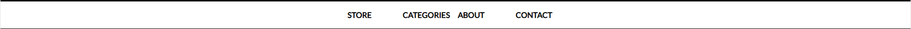
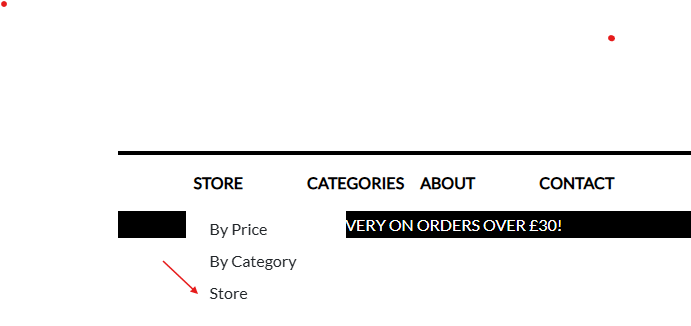
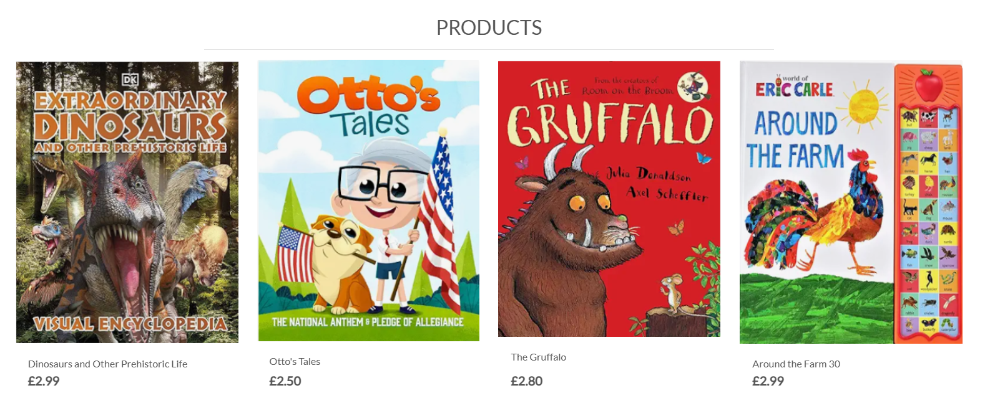
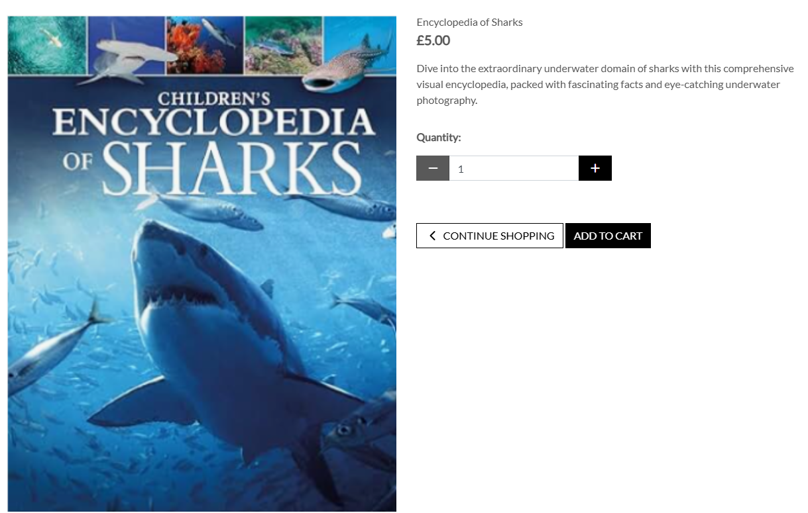
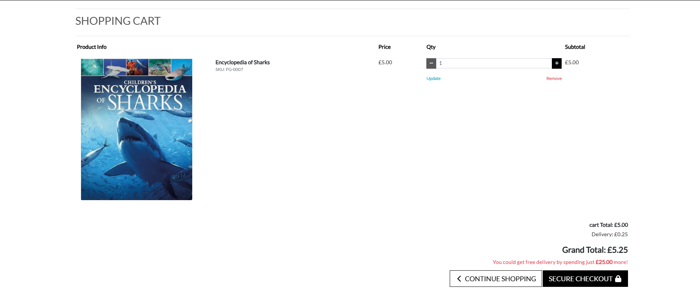
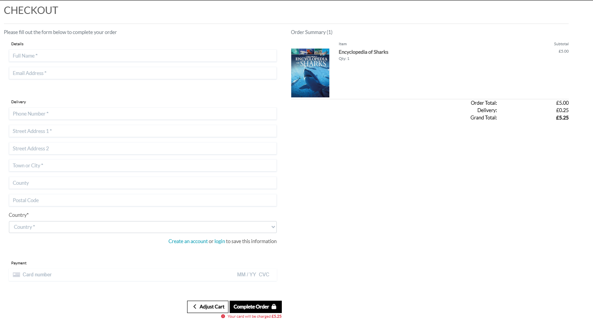
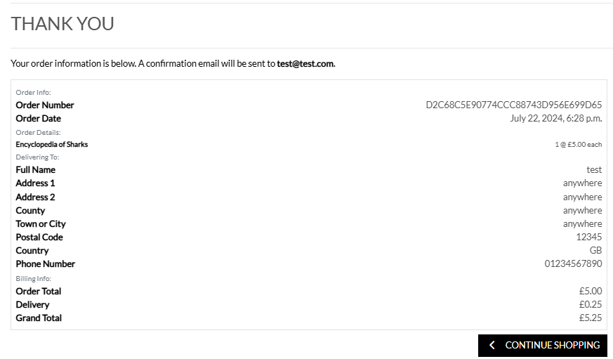
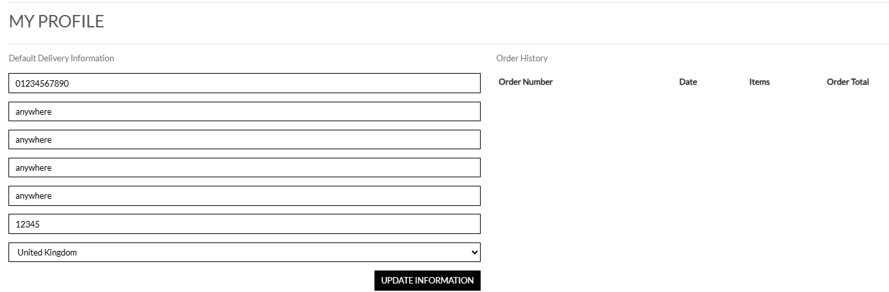

# **BookStore**

[Visit the website here](#)
[Link to Github repo](#)

This website is developed with the aim of selling books

Target Audience-

The website basically targets parents who look for books to enagage their toddlers in activities like coloring, stories etc which would help keep them off mobiles, laptops/ tabs etc  

**Developer Goals** :

To help users enable to find the book of their choice for their toddlers with ease

**User goals**

As a Site User I want to register an account so that I can purchase products and save my information
Login

As a site user I can login in to my registered account so that I can access complete my orders on the store and see previous orders on my account

As a site user I want to logout of my registered account to ensure my details are safe 

As a site user I want to save my personal shopping details securely for future visits to the website.
Review a Product

As a Site User I want to view a list of products to be able to decide what i wish to buy 

As a Site User I want to click on a product so that I can read the full information on that product.

As a Site User I can sort the product list by price and name and also select by category

As a Site User, I can see my previous orders so I can find out what I ordered 

**Sections of the website**

1. Header- Logo, Search box, Cart & My account(authentication, profile & product management) 
2. Hero image 
3. Navbar - Store, Categories, About and Contact 
4. Delivery banner 
5. Product page 
6. Product Detail Page
7. Shopping Cart page 
8. Checkout Page 
9. Checkout Success Page

==

### **Header**

The header contains the company logo to the left-which is a link to the home page,  a search box in the center and My Account and Shopping cart icons on the right. 

My Account section is further broken in to Product Management, Profile & Log out links if user has completed authentication else has links to Register and Login

Shopping cart icon shows the sum of all products as a visual representation that the products are indeed added as you click the add to cart button  

See below image :

---

### **NavBar**

The navigation bar consists of the below:

#### Store: 

Clicking store section unfolds 3 options- to sort products by price, by name and to view all products

#### Category:

Unfolds categories of books in the store for ease of filtering out what one wants to buy 

#### About:

Provides details about the store 

#### **Home page and Hero Image**

The home page has an image of book to capture the attention of buyers & for ease there's a 'Shop Now' button that links to product page 

#### **Delivery Banner **

The delivery banner indicates the buyers to shop for £30 and more to get free delivery 

See image below with all the NavBar links:

### Products Page

Products page give a full list of products when 'store' is selected from tbe dropdown on Navigation link 'Store'

See below images : 

 

### Product Detail Page

The product detail page pops up once a product image is clicked from the products menu and provides details like the name, price and a desciption of the product. Along with this, there's an option to add the product to cart, select quantity and  continue shopping, which directs the user to products page to explore more options 

### Shopping Cart Page

Shopping cart can be opened once the user has added products to cart and then clicks the shopping cart icon on the top right hand corner of the website 

This page contains the images of the products added, name, SKU, price, quantity and an option to update or remove from cart, subtotal of each product, grand total (that includes cart total plus any delivery charge), message to the user if they have purchased less than delivery threshold to add more to the cart to get free delivery. There are also buttons to either continue shopping or proceed to checkout.

See below image : 

### Checkout page 

Checkout page pops a form for the user to fill their details including name, email address, delivery information, payment details and along with this it prompts the user to sign in or signup. There's an order summary page showing the user a summary of their order. 

Buttons to adjust cart, which takes back to the cart page to adjust and button to complete order are also a part of this page 

See below image :

### Checkout Success 

Check out success loads when the user clicks 'complete order' button in checkout page to confirm their order has been captured with an order no. 

There's button to continue shopping on this page to direct the user to shop more if they wish to 

See below image :

### Profile page 

Profile page has the users default delivery details with order history 

See below image :

**Technologies used**

* HTML5
* CSS3
* Javascript
* Python
* Django
* Bootstrap
* GitHub
* Gitpod
* Fontawesome
* Am I Responsive
* Chrome Dev Tools
* Amazon Web Services
* Stripe
* Heroku
* Elephant SQL

**Testing** 

The website was manually tested for the core functionality. The admin module of product management needs bug fixing which i am working on 

The website was tested for responsiveness 

## Deployment

---

The website was deployed to Heroku using the following steps on the CLI:

### Login or create an account at Heroku

* Sign up for an account in Heroku and login

### Creating an app using heroku create app command

### Add Config Vars

### Use git push heroku main to deploy

### Link local git hub repo to heroku to automatically update any changes to heroku

* Connect GitHub
* Login if prompted

### Connect to GitHub

* Choose repositories you want to connect
* Click "Connect"

### Automatic 

* Enable auotmatic deploy
  

### Final Deployment

* Click the view link to diplay the deployed website

### Forking the GitHub Repository

* Go to the GitHub repository
* Click on Fork button in top right corner
* You will then have a copy of the repository in your own GitHub account.
* GitHub Repository

### Cloning the repository in GitHub

* Visit the GitHub page of the website's repository
* Click the “Clone” button on top of the page
* Click on “HTTPS”
* Click on the copy button next to the link to copy it
* Open your IDE
* Type git clone (copied URL)   into the terminal

