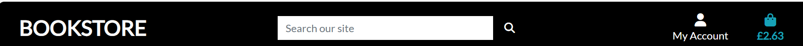

# **BookStore**

[Visit the website here](#)
[Link to Github repo](#)

This website is developed with the aim of selling books

Target Audience-

The website basically targets parents who look for books to enagage their toddlers in activities like coloring, stories etc which would help keep them off mobiles, laptops/ tabs etc  

**Developer Goals** :

To help users enable to find the book of their choice for their toddlers with ease

**Sections of the website**

1. Header- Logo, Search box, Cart & My account(authentication, profile & product management) 
2. Hero image 
3. Navbar - Store, Categories, About and Contact 
4. Delivery banner 
5. Product page 
6. Product Detail Page
7. Shopping Cart page 
8. Checkout Page 
9. Checkout Success Page

==

## **Header**

The header contains the company logo to the left-which is a link to the home page,  a search box in the center and My Account and Shopping cart icons on the right. 

My Account section is further broken in to Product Management, Profile & Log out links if user has completed authentication else has links to Register and Login

Shopping cart icon shows the sum of all products as a visual representation that the products are indeed added as you click the add to cart button  

See below for image 

---

### **Strategy**

To be in line with UX principles, first i thought  of a strategy to identify who the target users would be and what features they are looking for

Tasks/ ToDo app target users are:

* Aged 15 & over (Can be under 15's with parental permission to use electronics)
* People who love to be organized in term of their tasks 

User requirements:

* Simple and easy to use 
* Basic website with add, edit & delete functionalities

### **Structure**

The structure involves space to add new tasks, button to edit or complete tasks and a button to delete tasks 

## **Features**

---

This app is designed with an intent to help users to easily organize their tasks and update status 

### *Add New Tasks & Submit*

### *Edit/ Complete Tasks*

### *Delete*

## Technologies Used

The technologies i have used to create this website are as below-

    
  * [Django](https://www.djangoproject.com/)
  * [python](https://www.python.org/)
  * Used as the main programming language
  * [GitHub](https://github.com/)
  * Used to store code for the project after being pushed.
  * [codeanywhere](https://codeanywhere.com/)
  * Used as the development environment.
  * [Heroku](https://heroku.com/)
  * Used for deployment

## Testing

Testing was done manually during development, no automation created due to time constraints. Will be working this further for enhancement 

## Deployment

---

The website was deployed to Heroku using the following steps on the CLI:

### Login or create an account at Heroku

* Sign up for an account in Heroku and login

### Creating an app using heroku create app command

### Add Config Vars

### Use git push heroku main to deploy

### Link local git hub repo to heroku to automatically update any changes to heroku

* Connect GitHub
* Login if prompted

### Connect to GitHub

* Choose repositories you want to connect
* Click "Connect"

### Automatic 

* Enable auotmatic deploy
  

### Final Deployment

* Click the view link to diplay the deployed website

### Forking the GitHub Repository

* Go to the GitHub repository
* Click on Fork button in top right corner
* You will then have a copy of the repository in your own GitHub account.
* GitHub Repository

### Cloning the repository in GitHub

* Visit the GitHub page of the website's repository
* Click the “Clone” button on top of the page
* Click on “HTTPS”
* Click on the copy button next to the link to copy it
* Open your IDE
* Type git clone (copied URL)   into the terminal

## Credits

Have used various sources to arrive at the idea of designing the quiz

* You Tube Videos - Some of the code blocks are used following you tube videos of similar apps 
* Stackoverflow (for any error encountered)
* Hello Django walk through project & deployment steps 

## Acknowledgements

* This project could not be completed with authentication functionalities as a result of time contraints & also the fact that i was struggling with initial deployment which resulted in some code breaking, as a result of which i had a create a new repo and copy & paste the codes from the original repo (https://github.com/msnirmal/Portfolio4), which i was planning to submit. I will be working this further to get it up in entirety with authentication functionalities 
  
* The responsiveness of the website is an issue, that i am working to fix 
* Followed agile methodology, however, unfortunately, i lost all the user stories at the time of submission 
* The app needs more work on the aspects above & some more but submitting based on the fact that the main functionalities of add/edit/ compelte/ delete are working fine 

